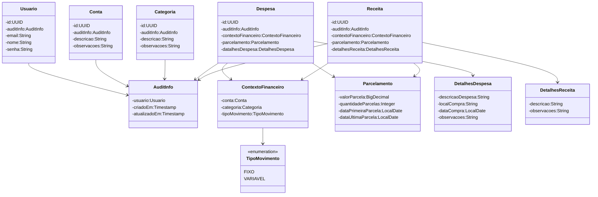

```mermaid
classDiagram

class AuditInfo {
    -usuario:Usuario
    -criadoEm:Timestamp
    -atualizadoEm:Timestamp
}

class Usuario {
    -id:UUID
    -auditInfo:AuditInfo
    -email:String
    -nome:String
    -senha:String
}
Usuario --> AuditInfo

class Conta {
    -id:UUID
    -auditInfo:AuditInfo
    -descricao:String
    -observacoes:String
}
Conta --> AuditInfo

class Categoria {
    -id:UUID
    -auditInfo:AuditInfo
    -descricao:String
    -observacoes:String
}
Categoria --> AuditInfo

class TipoMovimento {
    <<enumeration>>
    FIXO
    VARIAVEL
}

class ContextoFinanceiro {
    -conta:Conta
    -categoria:Categoria
    -tipoMovimento:TipoMovimento
}
ContextoFinanceiro --> TipoMovimento

class Parcelamento {
    -valorParcela:BigDecimal
    -quantidadeParcelas:Integer
    -dataPrimeiraParcela:LocalDate
    -dataUltimaParcela:LocalDate
}

class DetalhesDespesa {
    -descricaoDespesa:String
    -localCompra:String
    -dataCompra:LocalDate
    -observacoes:String
}

class Despesa {
    -id:UUID
    -auditInfo:AuditInfo
    -contextoFinanceiro:ContextoFinanceiro
    -parcelamento:Parcelamento
    -datalhesDespesa:DetalhesDespesa
}
Despesa --> AuditInfo
Despesa --> ContextoFinanceiro
Despesa --> Parcelamento
Despesa --> DetalhesDespesa

class DetalhesReceita {
    -descricao:String
    -observacoes:String
}

class Receita {
    -id:UUID
    -auditInfo:AuditInfo
    -contextoFinanceiro:ContextoFinanceiro
    -parcelamento:Parcelamento
    -detalhesReceita:DetalhesReceita
}
Receita --> AuditInfo
Receita --> ContextoFinanceiro
Receita --> Parcelamento
Receita --> DetalhesReceita
```