# Diagrama de classes

Este modelo de domínio representa o contexto financeiro da V1, incluindo a autenticação com OAuth 2.0 (Google). `Conta`, `Categoria`, `Despesa` e `Receita` compõem o contexto financeiro; `Parcelamento` representa a distribuição mensal. Os dados são isolados por `Usuario`, que armazena a identidade do provedor.

```mermaid
classDiagram
class Usuario { +UUID id +String email +String nome +String imagemUrl +String providerIssuer +String providerSubject +LocalDateTime ultimoAcesso }
class Conta { +UUID id +String descricao +String observacoes }
class Categoria { +UUID id +String descricao +String observacoes }
class TipoMovimento { <<enumeration>> FIXO VARIAVEL }
class ContextoFinanceiro { +Usuario usuario +Conta conta +Categoria categoria +TipoMovimento tipoMovimento }
class Parcelamento { +BigDecimal valorParcela +Integer quantidadeParcelas +LocalDate dataPrimeiraParcela +LocalDate dataUltimaParcela }
class Despesa { +UUID id +ContextoFinanceiro contexto +Parcelamento parcelamento +String descricao }
class Receita { +UUID id +ContextoFinanceiro contexto +Parcelamento parcelamento +String descricao }
Despesa --> ContextoFinanceiro
Despesa --> Parcelamento
Receita --> ContextoFinanceiro
Receita --> Parcelamento
```

Este modelo foi consolidado a partir do diagrama de classes inicial. A arquitetura definirá o modelo final.
