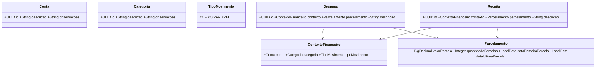

# Diagrama de classes

Este é um rascunho de domínio. `Conta`, `Categoria`, `Despesa` e `Receita` compõem o contexto financeiro; `Parcelamento` representa a distribuição mensal. `Usuario` permanece no desenho por compatibilidade histórica, mas autenticação está fora da V1 conforme o PRD.

Este modelo foi consolidado a partir do diagrama de classes inicial. A arquitetura definirá o modelo final.
